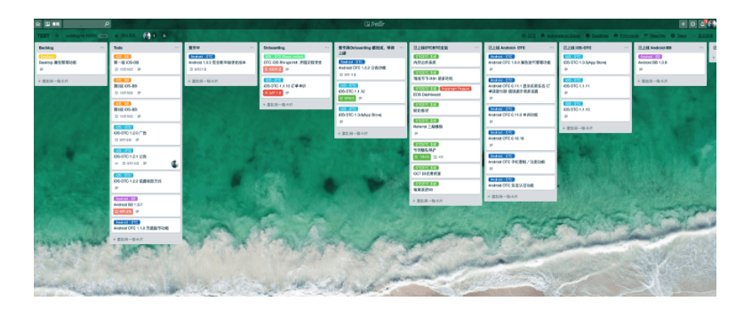
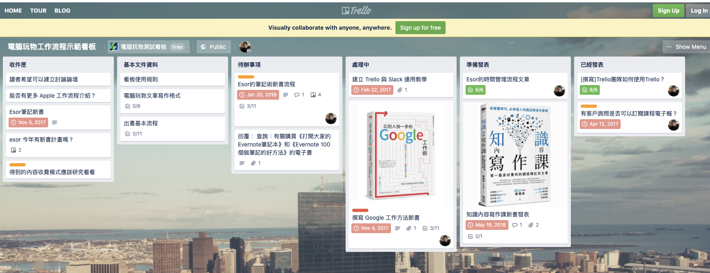
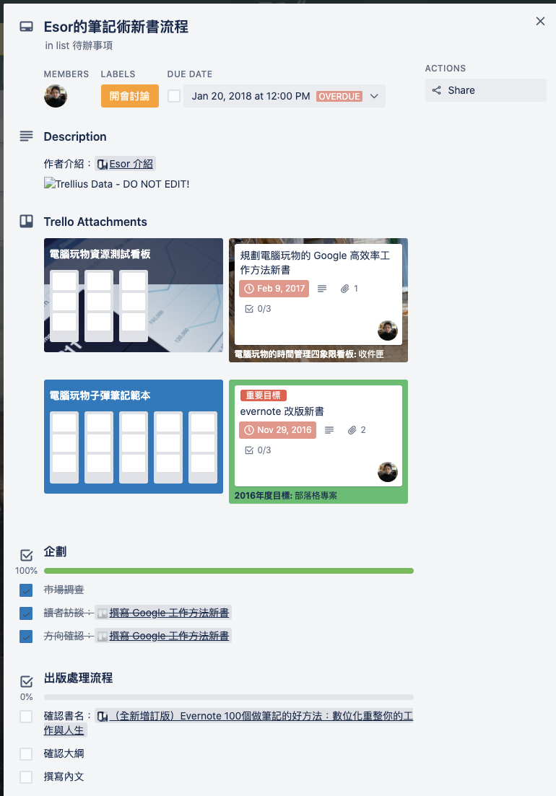

# Part 2: 接力篇

这一篇，我们要谈的是换手接力篇。

在公司里面，绝大多数的工作，并非是由一人独力完成。而是多人接力完成。

许多人转入 Remote 工作模式里面，觉得效率大减的原因是，在办公室里面，这些微小的「接力时间」被放大了。

在办公室里面，跟你协作的往往是固定两三个人，甚至你们的座位也坐在一起。所以这些接力时产生的沟通成本很低。也不需要有人主动负责把控进度。反正，如果进度对不起来，几个人关在会意识蛮力坐在一起改，总能出成果。

但是，这样的便利在遠程工作中就會消失了。

那么，我们怎样把生产力带回来呢？

## TIPS 1: 导入项目管理系统

如果你公司有遠程團隊，卻沒有任何一套項目管理系統，我建議你立刻裝一個。因為沒有導入項目管理系統，我教你什麼技巧都是枉然。

远程工作的接力成本，是因为原本办公室里面，进度「飘在空气」里。所以要知道一件事的进度，只要走进「空气」里面就可以了。

问题是在远程的时候，「空气」就消失了。

于是你需要一个「空间」展示」这些进度。这个「空间」就是「项目管理系统」。

### 多人项目、远程项目标配

在我还不是职业程序员前，我曾经以为协作是很简单的。两个人一起工作，顶多用 email 或者 skype 软件互相沟通需求就好了。

后来变成程序员以后，才发现协作这件事情并不简单。

大家可以猜一下。一个小型网站项目。在上线之前，需要完成多少子项目。

很多人可能会猜 100？200？300？总不可能是 500 吧？

答案是 600 个。我生涯当中做过很多项目。一个网站要上线，就是得经过这么多道工序。

以我上一个项目比特币交易所为例好了。当时这个项目是 35 天之内写出来的。即便我们在上线前已经尽量压缩工期，以及工作项目了。

但是，这个项目的开发与上线也是花了至少有 600 道任务。

只是一般来说，一个网站通常3-4名程序员就可以完成。这个网站是由大约10名程序员接力完成。

35 天，接力进行 600 个任务，还是 10 人的大队接力。

对一般非软件从业界的人来说，听起来简直是天方夜谭。

在这么短的时间，数量这么多的任务，这么多的参与工作人员。究竟要怎么协同安排的呢？

很重要的一个因素：是公司里面要有项目管理系统。

一般行业，几乎很少听闻有导入什么项目管理系统。

是因为绝大多数的小型团队，多属于这类场景：任务少且单纯、人数 3-5 人，且都坐在办公室。

只要转头「闻空气」就能得到答案，进度追踪也只要问责组长。因此根本没有什么上系统的必要。

但是，在程序员的世界里面，因为工序之多、迭代速度之快。即便是「闻空气」，也追不过来。

所以，项目管理系统，在程序员界非常的盛行，基本上是标配。

### 协作，不只是「沟通派分」，还牵涉「优先权管理」

没有用过项目管理系统的人。很难想像为什么需要这种东西。

但是我这样解释就明白了。你有可能遇到过这个场景，工作涉及的人真的很多，事情有可能很杂。

这时候你可能会写拿出 Excel，去将要做的事简单分梳一下。纪录优先权以及完成时间。

其实，这样就算是一个小型的项目管理系统。

而程序员用的只是更自动，更细节版本而已。

我们之所以要用上项目管理系统，是因为，当涉及到较复杂的协作。并非只有「沟通」让人头疼。

工作的「轻重缓急」以及「优先权管理」也让人十分头大。

工作内容是沟通了。但是什么时候开始做，又有多少工作要做，哪些是紧急的，那些是可以稍后再做的。这些都是重点。

很多时候，项目一大、待办事项一多、组内成员一多。原先的「空气式管理」会根本没办法用。

我见过许多草创的创业团队。内部根本没什么项目管理软件。沟通需求都是聊天软件、Email 满天飞。最后自己再用「个人 GTD 软件」管理自己什么时候需要回覆什么信。

平时还勉强硬付的过去。

但是，如果老板冲进来一时大吼。你们谁谁谁，可以跟我讲一下现在进度吗？估一下还要多久才能完工。想要提前上线？我想，就算是专门跟著此案的 PM，一时之间也说不出个准。

这是因为，绝大多数的工作组的进度，往往存在工作组两两之间。

没有人能够知道整个项目是长什么样子的，又还差多少内容达标。

引入项目管理软件，就是可以让团队成员知道，项目里面到底有哪些工作还没做完，而这些工作，进度又到哪里了。「任何人」而不只是老板，都可以一目了然，大概知道实时追踪到现在的工作进度。

关于项目管理软件如何提升工作效率的细部介绍，我们会在第四章深入详细介绍。这里只是先给各位读者一个概念。

如果你要引入 Remote 工作型态。项目管理系统不是 Nice to Have，而是 Must have。

### 以项目管理系统为轴心的协作流程

我们在工作时，常常会遇到以下的常见状况：

* A 团队成员说他正在做。但是三天却没有任何进度。到第五天以后你发现他完全做错了。（通常这会发生在 Junior 成员身上）
* 设计师说他晚上工作才有灵感，但是他老是凌晨四点才睡，下午一点才来公司。整个早上你根本拿不到他的档案，只能空等。
* 大家都在做同一个项目。但是大家没说好。导致两个人都在做同一个方向，浪费生产力。
* 有一些工作、决策，只存在 A 与 B 之间。但 C 与 D 不知道。变成出事的时候，根本不知道当初为什么要这样设计。或者是 A, B 讨论的很 high，而且已经觉得它们讨论的内容进度全 team 都知道了。但事实上，真的只存在 A 与 B 的聊天记录里面而已。。。。。

这不只是存在远程工作，而是真实存在日常工作里面。只是在远程工作里面，这样做的坏处，会被放大一百倍而已。

#### 任何工作必须开票

我们如何解决这个问题呢？

在我的团队里面，有一条铁的内规：凡做事必开票（Ticket，专案管理系统上的最小工作单位）。不开票就不做。

就连我身为老板或团队负责人，都需要遵守。就算我口头交代了属下。事后我也要马上要补一张票给他。

为什么呢？

因为工作进项目管理系统，才能有效的追踪进度与生产力，降低误解，降低打断次数。

如果没有 Ticket，我只是口头交办。那么我如果要追踪这件事的进度，我甚至必须向对方时时轮循，对方也要时时跟我回报。如此一来，干扰岂不是很频繁吗？

更何况，没有规定回报的地方，我一下要 check 微信、一下要 check email、或者是甚至走到他旁边问。如此一来不是更烦吗？

所以，我现在真不敢想像没有项目管理的世界。有多少无谓的时间与来往被浪费了。

### 只有软件团队适合项目管理软件吗？

有一些非技术团队的朋友，曾经询问过我。是只有软件团队才适合导入项目管理软吗？

其实，我认为只要 2-3 人以上的协作项目，就应该导入项目管理软件。有了项目管理软件以后，各种信息的交换，文件的传递、进度的追踪，会变的更加便捷。

这里举我过去两本书 &lt;&lt;Growth Hack 这样做&gt;&gt; 以及 &lt;&lt;闪电式开发&gt;&gt; 这两本书的责任编辑「电脑玩物」站长 Esor 的一篇文章 \[為什麼大家愛用 Trello ？最佳整理教學讓事情井然有序\] [https://www.playpcesor.com/2015/06/trello.html](https://www.playpcesor.com/2015/06/trello.html)

他自己在制作新书的时候，就是利用 Trello 管控新书进度的。

为了要出版一本新书。Esor 除了要跟作者沟通协调进度之外，一本书的发行也需要同时跟很多出版社单位协作。诸如美编、校对、印刷等等。

没有一套好的 Tracking 与协作系统。有时候出的书一多，事情真的很容易会漏勾。

如果各位想看 Esor 示范怎么样管理一本书的出版。这里是 Esor 的示范网址：[https://trello.com/b/lmmrgkQt/%E9%9B%BB%E8%85%A6%E7%8E%A9%E7%89%A9%E5%B7%A5%E4%BD%9C%E6%B5%81%E7%A8%8B%E7%A4%BA%E7%AF%84%E7%9C%8B%E6%9D%BF](https://trello.com/b/lmmrgkQt/%E9%9B%BB%E8%85%A6%E7%8E%A9%E7%89%A9%E5%B7%A5%E4%BD%9C%E6%B5%81%E7%A8%8B%E7%A4%BA%E7%AF%84%E7%9C%8B%E6%9D%BF)

### 任何进度必须要更新在票上

更甚者。我们公司还规定，有任何进度必须更新在票上。

包括但不限于实做时遇到的 bug，写的简短代码笔记，找到的网址。开发时的画面截图。与对外窗口交涉时的 对话 LOG。总之你得把项目管理系统当作笔记用。

这不是因为我身为老板，有监控狂。而是，事实上这是提高接力效率的有效方法之一。

有时候，一个子项目，并不限于一个人完成。有时候会出现以下的状况：

* 原任务实做者，能力有限，无法突破。需要他人接手，如果没有之前的研究笔记，那么接手救援者，又要花费同样的研究时间去钻研。
* 原任务过于复杂，有多个备选决策 A, B, C。然而因为诸多考量，原任务实做者选择了 A。而接手者会疑惑他为什么选择了 B, C。但因为缺乏上下文，有可能接手者觉得 B 更高效。于是擅作主张，在接手时改成了 B。但事实上 选择 B 可能会有严重副作用。原任务实做者已经试过行不通，所以才选的 A。

这些隐藏的效率陷阱、效率地雷。都可以靠身为工作者的自觉进度更新，得到很大的消除。

这就是为什么这条工作习惯，后来变成我们团队的内规的原因。

### 将票的更新转化为参考文件

在前一章的附录。我有提过我会要求团队将工作记录在工作系统中，这个系统指的就是项目管理系统。

之所以「半强迫」团队成员要更新进度在票上的原因。很大的原因在于，当我们在实做时，贴这些进度或 Bug 讯息，去票里面是毫不费力的。

而当工作完成后。要写指南，基本上也只要复制票里面的内容，很快就可以修改成一篇指南。

一些朋友总会疑惑，为什么我老是有时间写 FAQ 以及工作接手指南。就是拜这个小习惯所赐。

* STEP 1: 工作时纪录更新、疑难杂症至项目管理系统
* STEP 2: 周末整理该周工作变成一篇篇文件与指南
* STEP 3: 每个月发表可公开的知识到博客

就是遵守这样的 Routine。

如果不用这样的方法。平日要一个团队成员凭空的写出一篇文件，基本上非常困难。越难大家就会越不想。而团队越少这些文件，效率就会越加低下。本身这就是一个负面循环。

这就是为什么我将「工作更新」列为团队强制开发习惯的主要原因。

如果一个新的团队成员，新加入我们的开发团队。第一个要接受的训练，就是与「写正规格式 Ticket 」的习惯养成练习。提交的工作内容与 Ticket 必须要有一定程度的说明与更新。如果他拒绝接受这个习惯，只愿意单纯提交代码，而不愿意记录工作内容 / 写笔记。我们会直接请这位同事离开团队。

因为这样的人，会造成我们团队里面具有很大的信息黑洞与协作障碍。

我们对于这个习惯的养成十分坚持。这就是为什么我们团队几乎个个的都是文件能手。

而我为什么写起文章与文件丝毫不费力。因为这样的工作流程，早已深入我们的骨髓基因里。

## TIPS 2: 站立会议

在平日工作时，我们会在大约中午 11:00 左右。各部门会有一个小会。大约 10 分钟。这个会议叫做 Standup Meeting。

Standup Meeting 故名思义，叫「站立会议」。这个会议真是「站著」开的。为什么要「站著」开呢？因为站著开，大家才不会「废话太多」。

在站立会议中，报告格式是这样的。你必需要在一分钟内报告以下事项：

* a. 我之前已經做了什麼
* b. 我現在要做什麼
* c. 之後我要做什麼
* d. 我需要其他人幫我什麼忙

每天举行一次这样的站立会议，有助于整个工作小组清楚项目内每个人的目前进度。避免工作进度互撞，也同时清楚同事可能的前进方向。

值得一提的是，「我需要其他人幫我什麼忙」这个环节相当重要。我们团队相当鼓励大家在站立会议里求助。这是因为有时候个人能力有限，与其蛮力硬解，不如交棒给更擅长的同事接手，可以更快的的到结果。

比如说我擅长后端开发，前端特效我略懂但是并不擅长。在站立会议中，如果我在实现这个功能时，遇到类似问题，我就可以很快的 hand over 后续的工作，给其他更擅长的同事。而非自己继续花三天去死搕。

而这时候，清晰完备的工作记录就很重要了。如果我原先的 Ticket 内容，已经记录了我之前遇到的困难、挣扎，曾经尝试的方案。这时候同事就不用跳我之前的坑，同时，我需要的效果在里面也写的清清楚楚。可能他只需要花十分钟就能重现环境，然后 3 分钟之内，就把原先我可能要挣扎 3 天的困扰解决掉。

所以。一些工作习惯真是一环扣一环的。如果我们没有强制更新工作记录的规定。 handover 工作时，对人人几乎都是一件成本高昂痛苦的过程。

所以要建立高效的接力过程，一些看似诡异的工作流程与习惯，真是非常必要的。看似多做一道工，其实反而是提升整体效率。

## TIPS 3: 公德心

若要我总结围绕著远程工作接力的一个核心关键字，我会说「公德心」

因为远程工作，重做返工，是一件成本很高的事。

于是，团队成员有没有「公德心」就是一个很重要的关键。我们团队里面评量「公德心」的一个关键就是，交出的工作内容，是不是能让其他人马上接手，或者是可以马上部署。尽量的节省他人工作时间。

浪费他人时间的行为。我们会视为「谋杀」（真的是阿。既生气又要浪费时间擦屁股，的确是减少寿命的行为）

那么，如何培养公德心呢？

我会归纳为三个原则：

1. 透明
2. 广播
3. 接口

### 透明

所谓透明，就是工作进度透明。老实说，都是同一个公司的。创造的成果也是大家共享。实在是没必要藏招藏进度。越藏只是越造成损失而已。

知名对冲基金馆者 Ray Dalio 的，也是这样形容自己的公司桥水基金：Radical Transparency。唯有几近透明，才能有效的提高公司效率，创造更好更丰硕的成果。

当然，写到这里。你会担心机密泄漏的问题。这一个议题，我们会在本书最后一章「法律篇」提出解决方案。但一般来说，在公司里面，进度真的是没好藏的。

一般来说。在不涉及商业机密的前提下。会想要进度不透明的状况。往往只有害怕暴露自己弱点与效率的原因而已。

所以，打造远端协作环境时，团队 Leader 的态度是一个很关键的因素。团队 Leader 要负责创造一个可以让团队成员大胆承认进度赶不上，犯错的环境。如果真做不来，做不出来。一切都能提前换手，沟通解决。

### 广播

而第二个原则是广播原则。

读者会很好奇。即便公司里面创造良好的协作 protocal。但是在家工作。每个人的上班时间不固定，休息时间也不固定。

我们如何降低换手之间的等待问题。比如说我们之前举的例子。「设计师晚上四点才睡觉，下午一点才来上班」

或者是，工作真的很累。但是我不敢跑出去吃饭或午睡。怕一睡就有其他人来找我。造成其他人的等待困扰。

我的建议是「想吃就吃、想睡就睡」。

这是真的。

我们公司没有管过大家要几点上班、几点吃饭、几点睡午觉。大家想吃就吃，想睡就睡。甚至什么时候请假。

唯一的条件，是你要事先告知「全公司」。

是的。就是告知全公司。

比如说像我如果确定我会离开键盘超过 1 小时，我就会明确的在公司公频，我呆会要去吃饭、午睡、出门开会、看医生 etc.

这样的好处，是别人明确知道你在不在键盘前面，而不会造成与你协作的人空等。

如果你不说，我们就会预设你可能都在电脑前面。然后我们预期你回覆的时间，是一小时之内。（通常大家都是工作 45 分钟内，会看一下聊天软件）

而如果我明确的希望别人在一个时间不要打扰我。比如说我接下来希望花完整的 3 个小时，去攻克一个超极大难题。我也会明确的公告，在这三个小时，天塌下来都不要来找我。

这样就能有效的 block 不必要的干扰。

甚至，我们鼓励所有的细节讨论，都透过项目管理系统，与决策都透过公频进行。而非私频讨论。

Remote 工作与 Inhouse 工作，在本质上有蛮多不一样的细节。在公司里面，我们通常不会到处公告我们等一下要干嘛，也不会开个喇叭一直广播我们正在讨论什么问题。

但是 Remote 的原则几乎是反过来的。基本上要高效的原则，却是要时时主动广播自己的动态。这样你才不会遭受非预期的打断与干扰。同时让别人更有效的知道如何与你协作。

### 接口与打磨

最后，是接口。因为返工往往是非常大的损失。所以在远程协作时，我们对于交付件，往往是提前沟通。

比如说一个小项目。我们就会切成多个 checkpoint，分段验收。而不是最后一次再大验收。

而交付格式也提前沟通。比如说需要一张海报。我们会直接先指定需要的 size、用途、偏好颜色、...etc.。（程式代码更不用说。我们一开始就会定义 API 接口的数据结构。先定义接口才开始写功能）

而交付的人，在交付时，也不会只提交一个版本的 work。可能会同时交付多个候选版本。

比如说同事给 pm 审核海报时，多半一次给出 6 张。于是决策可能会是这样的。merge 1 与 3 的架构，但是使用 6 的颜色。

另外，一个小细节就是。在每个 checkpoint。我们交付的不会是半成品。而往往是粗糙的完整版。

这是我们过去平台上的一个储值介面的设计稿。

这个第一版本身自己就是一个「规格」。

然后随著不同时间迭代，逐渐「重构打磨」细节。

这三个介面有很明显的细腻差异。

但是共同特征就是无论哪一个版本，扔出去都能上线使用。

## TIPS 4: 识别剔除打混党

当然。即便整个流程设计的如此流畅。有时候你还是会遇到一些例外。比如说某个同事想离职、或者家礼遇到状况、或者单纯就是新进工作习惯不好，爱打混。

但是远程工作，很难抓出来它们是失误问题，还是能力问题，还是其他因素干扰。以下我有几个 tips，协助你「真侧异常」

### 1. 设立 checkpoint

对于稍微大一点的任务。与其整包交付给某人。而是在工作一开始，大家就坐下来一起拆分每个时间有的进度。透过 Standup Meeting 逐一达成。

这样的方法，有办法有效协助新进成员，或者是相对 Junior 的工作者。了解工作是怎么拆分的，同时有效的分散工作压力、ˋ进度。

也可以确保在每个节点收到的工作成果是正确的。

### 2. 提高 Standup 透明度

Standup Meeting 这一件事有一些小诀窍。

**a\) Standup Meeting 不许请假**

我们公司的内规是全公司周一的 Standup Meeting 不允许请假。除非有重大事由。

而个别团队的每日 Standup Meeting。不允许迟到。如果有组员有上班时间错位的问题，那么大家必须要同时协调出一个同时都在的时间。在该时间开会。

**b\) Standup Meeting 必须开镜头**

Standup Meeting 的原则是诚实叙述进度，这就是 Standup Meeting 为什么要站著而且面对面。即便在远程，都应该开著镜头。眼睛看著你的队友说进度。这样进度是不是假的就非常容易侦测

**c\) 禁止以工作报告形式提交 Standup**

有些团队会嫌因为工作组大，集体来一次 Standup Meeting 麻烦。所以会以交工作报告形式。

我曾经也遇过这个问题。在 20 人团队里面，我为了节约大家的时间，曾经一阵子换成大家提交 Standup 问题形式的工作报告。

但这个举措，却使整体团队工作效率大大的下降。因为大量的「作文党」出现。工作报告上洋洋洒洒，但实际上什么工作却没完成。

于是。我后来又把面对面会议改回来的。如果你觉得组太大，开一轮 Standup 太花时间，你应该将组拆小。比如说 Amazon 著名的两个披萨理论。指的是团队的人数相当于可以吃掉2个披萨。也就是每个组尽量不要超过 10 个人。超过就分拆。

### 3. 有效识别假进度

因为这 12 年来，我一直都在改善这个流程。见过各式各样的工作者。于是我也就练就了一身鉴定甲进度的功夫。常见的假进度词如下：

* 我正在研究：正在研究就是我没有什么头绪的意思
* 做到一半：做到一半就是还没做意思
* 快做完了：快做完就是刚做
* 周五给你：就是下周一给你的意思
* 还要两个礼拜：就是他根本作不出来

有意思吧。读者可以思考过去的工作场景（邪恶微笑），是不是如此。

## TIPS 5: 寄送工作报告

在 2014 年我所在的团队。本质上是台美两地的团队。美国部分是客服与运营团队，台湾是技术开发部分。

公司曾经有一段高速扩张时间，这段时间两边都痛苦不堪。

原因是美国的客服团队，是钟点制轮班的客服团队。客户常常遇到 App 端有些故障，或者是服务品质瑕疵，虽然客服团队会收集之后汇总给技术团队。

但是往往却不知道技术团队何时才能修复这些 bug。

再来，有一阵子技术团队扩编，功能猛上，很多时候客服也不知道技术团队在晚上偷偷上线了或改坏的什么功能。隔天客户一问三不知。

而且因为当班客服主管与技术主管，并不在同一个时区，所以这个问题很难被改善。客服团队总是对技术团队非常不满。技术团队也很挫折，因为技术团队也不知道回报的这些bug的优先权，很难排定优先级，以及确认「自己修对了没有」（技术 Team Lead 只能确认技术上正确）。

后来我们团队实行了一个举措，大大改善的沟通效率。

### 下班之前，双向寄 Log 给对方团队

比如客服团队就会寄这样内容的汇总，给技术团队，回报它们当班遇到的各样问题，并由技术团队去开票排进隔天的工作优先级里面。

然后，技术团队界接上自动部署系统。每一个版号会收集程序员推送的功能 patch 成开发日志。

最后，负责与 CS 对接的程序员，会每日翻译这些自动开发日志，寄给客服组，说明今日变动。

确保双方团队，都能在上班的第一分钟，拿到最新更新信息。

## TIPS 6: 轮调工作

当在这个台美混合团队时，我们遇到的另外一个挫折点。是无法「互相体谅」。

客服组同事有时候很挫败，觉得明明回报一个简单的问题，只要「用过 App」，就会知道不应该设计出那么诡异的解决方案。为什么台湾程序员不愿意花时间研究，埋头做出一个很诡异的功能。

在台湾的程序员，也是很挫折，自己花了老半天打磨了很久的功能，直接被 CS 客服的打枪不能用。改了老半天也不知道自己问题在哪。

后来，我有一次出差去美国以后，实际坐在 CS Room 跟美国同事一起工作以后，才发现问题在哪里。在台湾的时候，我们都是对著后台数据，模拟可能的下单行为，而从来没在美国实际点餐过。

所以有一些客服的抱怨，实际上真的得在有真人时段，打开 App，才知道问题在哪里。

所以我们后续调了一些工程师轮调去美国，实际坐在 CS room 里面，果然很快的就知道问题在哪里。

这个情形也发生在我后来开的比特币交易所里面。我后来在抽查公司客服 Log 或者是某些程序员写的原型时，感觉回客户的话，以及做出来的东西，离实际上的差很远。

我后来发现有一些同事，是真的只是「在做他的工作」，而没有实际使用产品。立刻拿了一笔钱让它们实际开户练习交易，它们立刻就发现自己工作成果上方向偏差的问题。

而后来，我们甚至也会要求新进的同事，都去客服岗位练一会。有没有练这一会，会造成后续工作差很多，蹲过客服岗就能体会到为什么别人会提出这样的需求。

## 附录

* [附录 8：如何写SOP & 操作性文档模板](fu-lu/extra-08.md)
* [附录 9：新功能发布如何同步全公司](fu-lu/extra-09.md)
* [附录 11：开票解票 Workflow](fu-lu/extra-11.md)
* [附录 13：客服与技术团队协作流程](fu-lu/extra-13.md)
